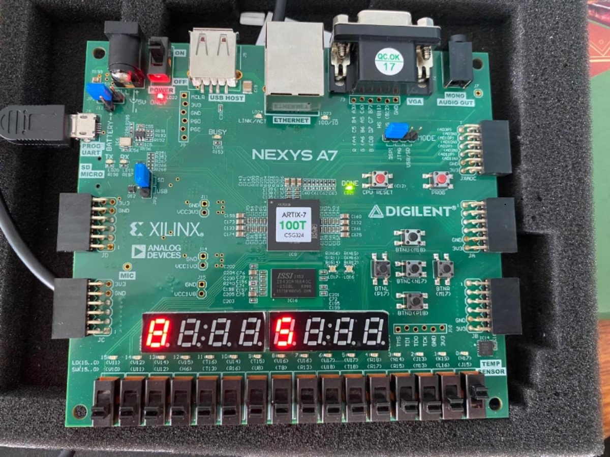
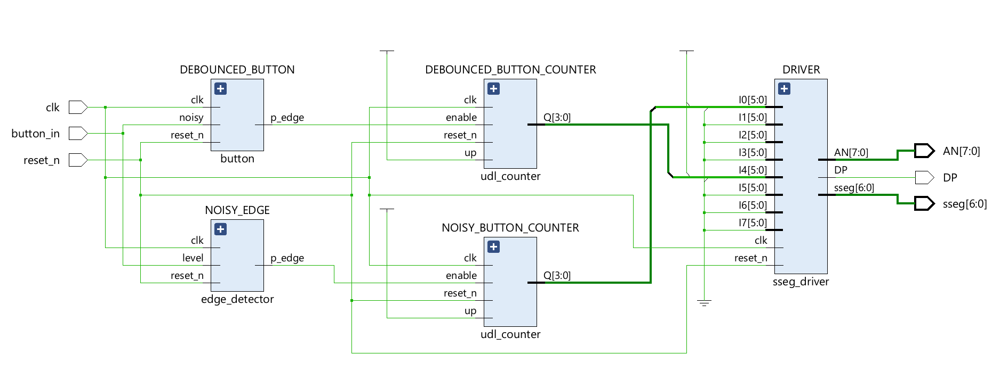
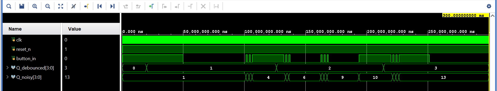

# Debouncing Circuits and Edge Detection using FSMs

This project focuses on designing and implementing FSM-based modules for debouncing a mechanical switch and detecting signal edges. The modules are developed in Verilog HDL and synthesized for deployment on the Nexys A7 FPGA board (Artix-7 100T, CSG324 package).

## 🔍 Overview

- Mechanical switches generate noisy transitions (bounces) during pressing or releasing.
- This project addresses bounce noise using a finite state machine-based debouncer.
- An edge detector is also implemented to identify rising and falling transitions of the cleaned signal.

---

## 🚀 Key Features

- **FSM-Based Design**: Built FSMs to perform both debouncing and edge detection.
- **Verilog Implementation**: Developed modules in Verilog HDL for hardware synthesis.
- **Synthesis & Implementation**: Synthesized the design and generated bitstreams for the FPGA.
- **FPGA Deployment**: Loaded the design onto the Nexys A7 using Xilinx Vivado.
- **Functional Testing**: Verified debounce and edge detect modules using real hardware behavior.

---

## ⚙️ Technical Description

- An edge is detected when the push button is pressed.
- The debounce FSM ensures transitions are only recognized if the signal remains stable for at least 20 ms.
- A two-stage synchronizer is used to safely sample the asynchronous input and prevent metastability.
- The correct operation is verified by incrementing a counter only on valid button presses.
- Output is displayed on the FPGA’s 7-segment display using custom timers, counters, and multiplexing logic.
- The difference between raw and debounced button signals is shown for visual comparison.

### 🧱 System Schematic

---

## 🧪 Simulation and Verification

- A testbench simulates the mechanical button’s noisy signal for initial validation.
- The design is further verified on hardware using the Nexys A7 FPGA.
- The comparison between clean and noisy inputs confirms the effectiveness of the debounce and edge detection logic.

### 🧷 Xilinx Vivado Simulation

---

## 📄 License

## This project is licensed under the **MIT License**.

For further queries, contact:  
Email: [anshuman.mondal@iitg.ac.in]  
LinkedIn: [github.com/anshumanmondal2006](https://github.com/anshumanmondal2006)
